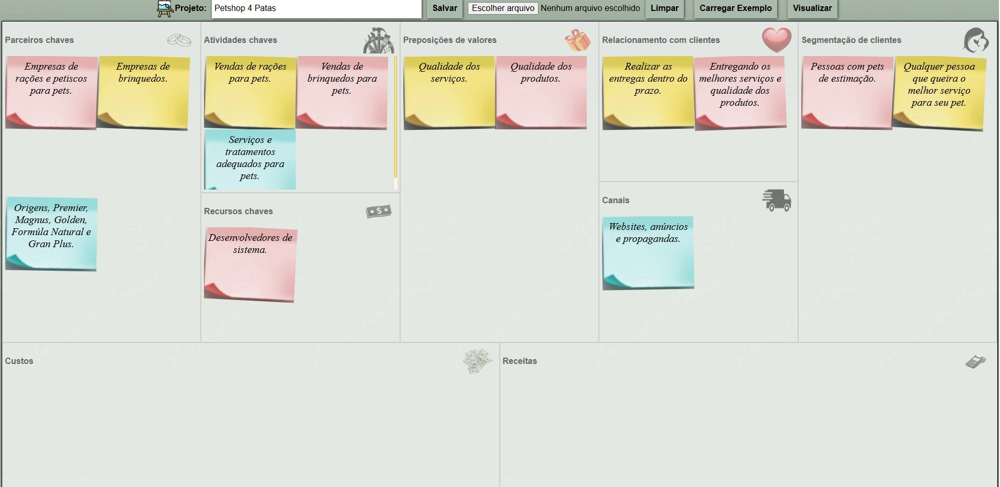

# Documentação - Petshop 4 Patas 🐾

Este repositório contém toda a documentação referente ao projeto **Petshop 4 Patas**.

---

## 🧠 Canvas

---

## 📅 Cronograma

---

## 📊 DER - DCU - DA

### DER (Diagrama Entidade Relacionamento)

### DCU (Diagrama de Casos de Uso)

### DA (Diagrama de Atividades)

---

## 📌 Jira - Kanban

---

## 💡 Análise SWOT

---

## 🔺 Triângulo de Ferro

---

## 🎨 Link do Figma

Acesse o protótipo no Figma:  
🔗 [Clique aqui para acessar](https://www.figma.com/design/tflvVzcUeXVv9C0by0dUCf/Petshop-4-Patas?node-id=0-1&t=AzANg3BaGiPewRdf-1)

## 🛠️ Metodologia: Kanban

Para a gestão e organização do desenvolvimento do projeto, utilizamos a metodologia ágil **Kanban**. Essa abordagem permite uma visualização clara das tarefas, facilitando o controle do fluxo de trabalho e garantindo uma melhor organização da equipe.

O quadro Kanban foi organizado com as seguintes etapas:

- 🔵 **Backlog** – Lista de tarefas a serem realizadas.
- 🟡 **Em andamento** – Tarefas que estão sendo desenvolvidas no momento.
- 🟢 **Concluído** – Tarefas finalizadas e revisadas.

## Grupo
Erick Aguiar
Thiago Muniz 
Justo Willian
